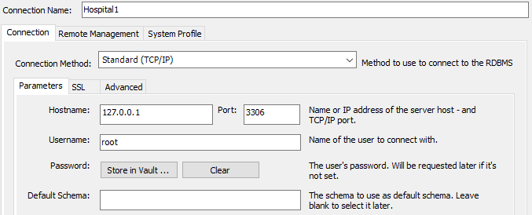
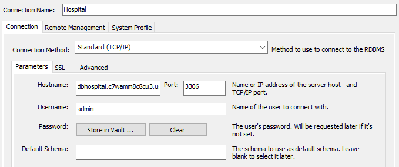
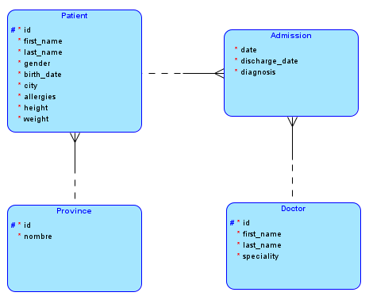

# Ejemplos de Subconsultas en MySQL con Amazon RDS

## Grabación
[Link Grabación](https://drive.google.com/file/d/1CqdIHDUzxcXVwTNSWBYh7q4siDXlMyRF/view?usp=sharing)

## Conexión Local

## Conexión Con RDS

## Modelo Lógico

## Modelo Físico
