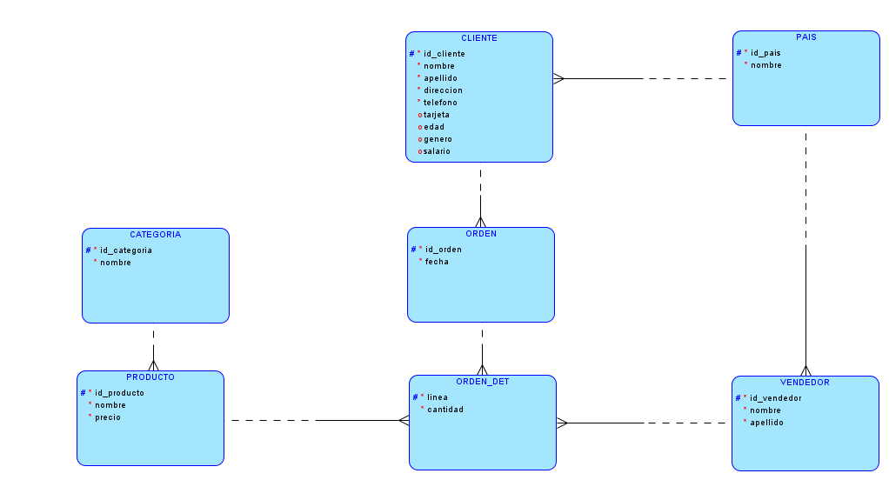
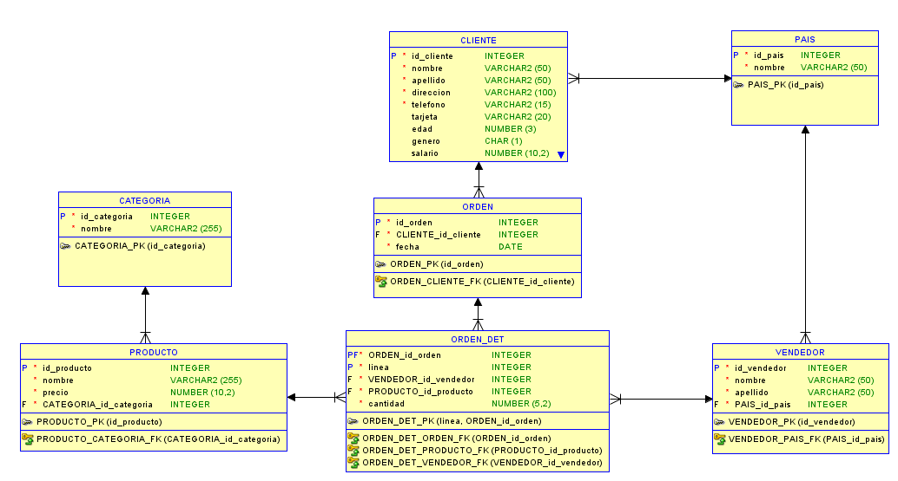

# Ejemplos de Subconsultas en MySQL sobre Docker

## Grabación
[Link Grabación](https://drive.google.com/file/d/1ipPp7p3Nf2mA8i5zbi_Tj1krw_Az--qL/view?usp=sharing)

## Resumen
En esta sesión vimos un poco de Docker y cómo usar MySQL en un contenedor. Luego vimos un ejemplo práctico de subconsultas en MySQL tratando de ejemplificar un caso de una solicitud de un reporte.

Para tratar de realizar lo visto en el taller se deben seguir los siguientes pasos.

- Instalar MySQL de cualquier forma de las que se enseñó, como una instalación local, como una instancia en la nube o bien utilizando Docker.
- Ejecutar el script ```DDL``` y luego el script ```DML``` para poder crear nuestra base de datos con la información.
- Listo, ahora tenemos nuestra base de datos con información para realizar el ejemplo del taller o bien nuestras pruebas personales.

### Explicación del Ejemplo
El reporte realizado se basa en una petición de mostrar los países a los que se les vende mas del 25% de las ventas totales de la empresa, para realizarlo seguimos los siguientes pasos.

- Obtener el 25% de las ventas totales de la empresa
```sql
    select sum(od.cantidad * p.precio) * 0.25 veinticinco_porciento_ventas
    from orden o
        inner join orden_det od on o.id_orden = od.id_orden
        inner join producto p on od.id_producto = p.id_producto;
```
- Obtener el monto comprado por cada país
```sql
    select p.nombre, sum(od.cantidad * po.precio) monto_comprado
    from pais p
        inner join cliente c on p.id_pais = c.id_pais
        inner join orden o on c.id_cliente = o.id_cliente
        inner join orden_det od on o.id_orden = od.id_orden
        inner join producto po on od.id_producto = po.id_producto
    GROUP BY p.nombre;
```
- Obtener el resultado final uniendo las consultas anteriores usando subconsultas
```sql
    select nombre, monto_comprado
    from (
            SELECT p.nombre, SUM(od.cantidad * po.precio) monto_comprado
            FROM pais p
                INNER JOIN cliente c ON p.id_pais = c.id_pais
                INNER JOIN orden o ON c.id_cliente = o.id_cliente
                INNER JOIN orden_det od ON o.id_orden = od.id_orden
                INNER JOIN producto po ON od.id_producto = po.id_producto
            GROUP BY p.nombre
        ) paises
    where monto_comprado > (
        select sum(od.cantidad * p.precio) * 0.25 veinticinco_porciento_ventas
        from orden o
        inner join orden_det od on o.id_orden = od.id_orden
        inner join producto p on od.id_producto = p.id_producto
    )
```

## Información de la Base de Datos

### Modelo Lógico


### Modelo Físico
